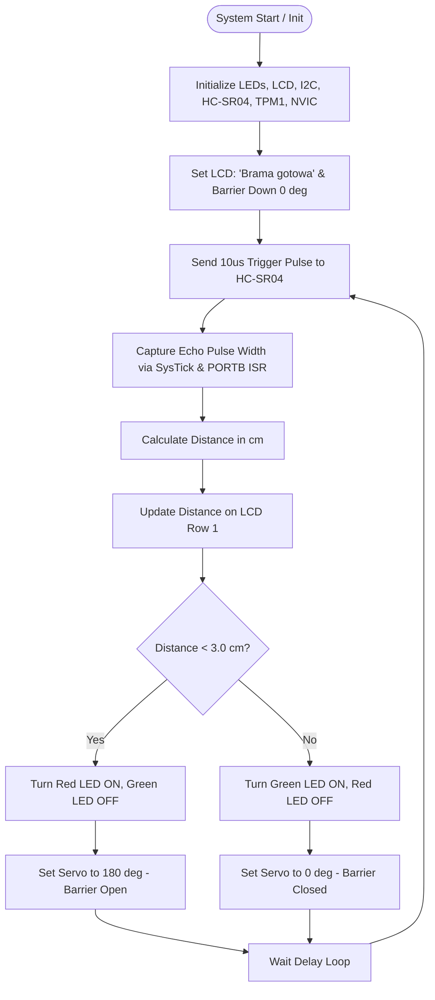

# Embedded Parking Barrier Gate Simulation System

[-blue.svg)](https://www.nxp.com/)
[]()
[]()
[]()
[]()

An autonomous, embedded **Parking Barrier Gate Control System** developed on the **NXP FRDM-KL05Z** evaluation board powered by an **ARM Cortex-M0+** core. The system features real-time ultrasonic proximity sensing, PWM servo actuation, I2C LCD status reporting, LED traffic signaling, and interrupt-driven tactile controls.

Developed as part of the **Microprocessor Techniques 2 (Techniki Mikroprocesorowe 2)** curriculum at **AGH University of Krakow** by **Maciej Filipiak**.

---

## Table of Contents

- [System Overview](#system-overview)
- [Key Features](#key-features)
- [Hardware Architecture & Components](#hardware-architecture--components)
- [Pinout & Peripheral Mapping](#pinout--peripheral-mapping)
- [Project Directory Structure](#project-directory-structure)
- [Functional Modules & Working Principle](#functional-modules--working-principle)
  - [1. Ultrasonic Proximity Sensing (HC-SR04)](#1-ultrasonic-proximity-sensing-hc-sr04)
  - [2. Servo Barrier Actuation (PWM via TPM1)](#2-servo-barrier-actuation-pwm-via-tpm1)
  - [3. I2C Character Display (LCD 1602)](#3-i2c-character-display-lcd-1602)
  - [4. Traffic Light & LED Indication](#4-traffic-light--led-indication)
  - [5. Tactile Pushbuttons & NVIC Interrupts](#5-tactile-pushbuttons--nvic-interrupts)
- [Getting Started & Build Guide](#getting-started--build-guide)
  - [Prerequisites](#prerequisites)
  - [Compiling and Flashing](#compiling-and-flashing)
- [Operating Logic Flowchart](#operating-logic-flowchart)
- [Author & Acknowledgments](#author--acknowledgments)

---

## System Overview

The project simulates an intelligent automated parking access barrier. The microcontroller continuously monitors vehicle proximity using an HC-SR04 ultrasonic sensor, triggers a servo-actuated gate arm, updates an alphanumeric I2C LCD with real-time distance readouts, and visually alerts drivers through RGB status LEDs.

### Core Objectives:
- Low-level peripheral register programming using CMSIS on bare-metal ARM Cortex-M0+.
- Hardware timer and PWM generation for precise micro-servo position control.
- Input capture and SysTick-based echo timing using GPIO external interrupt service routines (ISR).
- Synchronous two-wire I2C communication with an LCD expander module (PCF8574).

---

## Key Features

- **High-Precision Proximity Detection**:
  - Distance measurement via HC-SR04 ultrasonic sensor with SysTick sub-microsecond pulse timing.
- **Precision PWM Servo Control**:
  - Hardware Timer/PWM Module (TPM1) driving a 50 Hz PWM waveform with angular resolution from 0 deg (barrier down) to 180 deg (barrier up).
- **Real-Time I2C LCD Display**:
  - 16x2 character LCD via I2C PCF8574 interface displaying live gate status (`"Brama gotowa"`) and measured distance in centimeters.
- **RGB Visual Traffic Signaling**:
  - Red / Green LED transition indicating access permission and barrier status.
- **Interrupt-Driven Button Controls**:
  - Port A external interrupts with software debouncing for manual overrides.
- **DAC Sound / Analog Generation Ready**:
  - Integrated 12-bit Digital-to-Analog Converter (DAC) driver for acoustic signaling.

---

## Hardware Architecture & Components

- **Microcontroller Board**: NXP Freedom FRDM-KL05Z (MKL05Z32VFM4, ARM Cortex-M0+ @ 41.94 MHz, 32 KB Flash, 4 KB SRAM).
- **Proximity Sensor**: Ultrasonic Sensor module HC-SR04 (2 cm to 400 cm range).
- **Actuator**: Micro Servo Motor (SG90 / MG90S, 50 Hz PWM control).
- **Display**: Alphanumeric LCD 16x2 with PCF8574 I2C Backpack expander.
- **Indicators**: On-board / External RGB LEDs.
- **Inputs**: On-board tactile pushbuttons (S1-S4).

---

## Pinout & Peripheral Mapping

| Peripheral | Hardware Pin | Pin Function / Mux | Description |
| :--- | :---: | :---: | :--- |
| **HC-SR04 TRIG** | `PTB1` | GPIO Output (ALT1) | Ultrasonic 10 us trigger pulse output |
| **HC-SR04 ECHO** | `PTB5` | GPIO Input + Interrupt (ALT1, IRQC 0b1011) | Echo pulse width measurement on both edges |
| **Servo PWM** | `PTB13` | TPM1_CH1 (ALT2) | 50 Hz PWM output for servo position control |
| **I2C0 SCL** | `PTB3` | I2C0_SCL (ALT2) | LCD1602 Clock line |
| **I2C0 SDA** | `PTB4` | I2C0_SDA (ALT2) | LCD1602 Data line |
| **Red LED** | `PTB8` | GPIO Output (ALT1) | Active-low red LED (Stop / Barrier down) |
| **Green LED** | `PTB9` | GPIO Output (ALT1) | Active-low green LED (Pass / Barrier up) |
| **Blue LED** | `PTB10` | GPIO Output (ALT1) | Active-low blue LED indicator |
| **Button S1** | `PTA9` | GPIO Input + Interrupt (ALT1) | Manual override button with interrupt on Port A |
| **Button S2-S4** | `PTA10 - PTA12`| GPIO Input (ALT1) | Auxiliary control inputs |
| **DAC Output** | `PTB1` / DAC0 | DAC0_OUT | 12-bit analog voltage output |

---

## Project Directory Structure

```plaintext
Embedded/
|
+-- Parking_Simulation/
|   +-- main.c                          # Main control loop, sensor triggers, and barrier state logic
|   +-- main.h                          # Main definitions
|   +-- frdm_bsp.h                      # Board Support Package macros and CMSIS inclusions
|   +-- syslock.h                       # Critical section locking utilities
|   |
|   +-- TPM.c / TPM.h                   # Timer/PWM Module driver (TPM0, TPM1 configuration)
|   +-- lcd1602.c / lcd1602.h           # HD44780 LCD driver via I2C PCF8574 expander
|   +-- i2c.c / i2c.h                   # Bare-metal I2C bus driver
|   +-- leds.c / leds.h                 # GPIO RGB LED initialization and control
|   +-- klaw.c / klaw.h                 # Pushbutton driver with NVIC interrupt configuration
|   +-- DAC.c / DAC.h                   # 12-bit Digital-to-Analog Converter driver
|   |
|   +-- Filipiak_Projekt.uvprojx        # Keil uVision 5 Project configuration file
|   +-- Filipiak_Projekt.uvoptx         # Keil uVision Option file
|   |
|   +-- RTE/                            # CMSIS Device Startup & System files (MKL05Z4)
|   +-- Objects/                        # Compiled object files, build log, and .hex firmware
|   +-- Listings/                       # Linker map files
|
+-- README.md                           # Project documentation and technical specification
```

---

## Functional Modules & Working Principle

### 1. Ultrasonic Proximity Sensing (HC-SR04)
- A 10 us pulse is dispatched through `PTB1` via `HC_SR04_Trigger()`.
- The rising edge on `PTB5` starts the `SysTick` counter capture, while the falling edge captures the end timestamp in `PORTB_IRQHandler()`.
- Distance in centimeters is calculated using the time-of-flight equation:
  ```
  Distance (cm) = (echo_start - echo_end) * 0.00034
  ```

### 2. Servo Barrier Actuation (PWM via TPM1)
- The Timer/PWM Module (`TPM1`) runs with a prescaler of 64 on a 41.94 MHz clock source to produce a standard 50 Hz (20 ms) servo period (`TPM1->MOD = 13107`).
- `Servo_SetAngle(int angle)` modulates channel 1 pulse width between 1.0 ms (0 deg) and 2.0 ms (180 deg):
  ```
  CnV = (pulse_width * MOD) / 20000
  ```

### 3. I2C Character Display (LCD 1602)
- Driven over hardware I2C0 in master mode.
- Alphanumeric screen continuously displays:
  - Row 0: `"Brama gotowa"` (Gate ready).
  - Row 1: `"Dist: XX.X cm"` (Real-time distance reading).

### 4. Traffic Light & LED Indication
- Active-low GPIO logic driving the RGB diodes:
  - **Vehicle Detected (dist < 3.0 cm)**: Green LED extinguished (`PTB->PSOR`), Red LED illuminated (`PTB->PCOR`), Barrier opened (180 deg).
  - **No Vehicle (dist >= 3.0 cm)**: Red LED extinguished (`PTB->PSOR`), Green LED illuminated (`PTB->PCOR`), Barrier lowered (0 deg).

### 5. Tactile Pushbuttons & NVIC Interrupts
- Configured on Port A (`PTA9`-`PTA12`) with falling-edge interrupt triggers and software debouncing in `PORTA_IRQHandler()`.

---

## Getting Started & Build Guide

### Prerequisites

- **Keil MDK-ARM (uVision v5.20+)**
- **NXP Kinetis KLxx Device Family Pack (DFP)** installed via Keil Pack Installer.
- **Hardware**: NXP FRDM-KL05Z development board + USB cable + external components (HC-SR04, Servo, I2C LCD).

### Compiling and Flashing

1. Connect the **FRDM-KL05Z** board to your PC via the **OpenSDA / Debug USB port**.
2. Open [`Filipiak_Projekt.uvprojx`](Parking_Simulation/Filipiak_Projekt.uvprojx) in **Keil uVision 5**.
3. Build the project:
   - Press **F7** or click **Project -> Build Target**.
4. Flash firmware onto the microcontroller:
   - Press **F8** or click **Flash -> Download**.
5. The board will reset and execute the parking gate controller firmware automatically.

---

## Operating Logic Flowchart



---

## Author & Acknowledgments

- **Author**: Maciej Filipiak ([GitHub: @Maacciiej](https://github.com/Maacciiej))
- **Affiliation**: AGH University of Krakow (AGH UST)
- **Course**: Techniki Mikroprocesorowe 2 (Microprocessor Techniques 2)